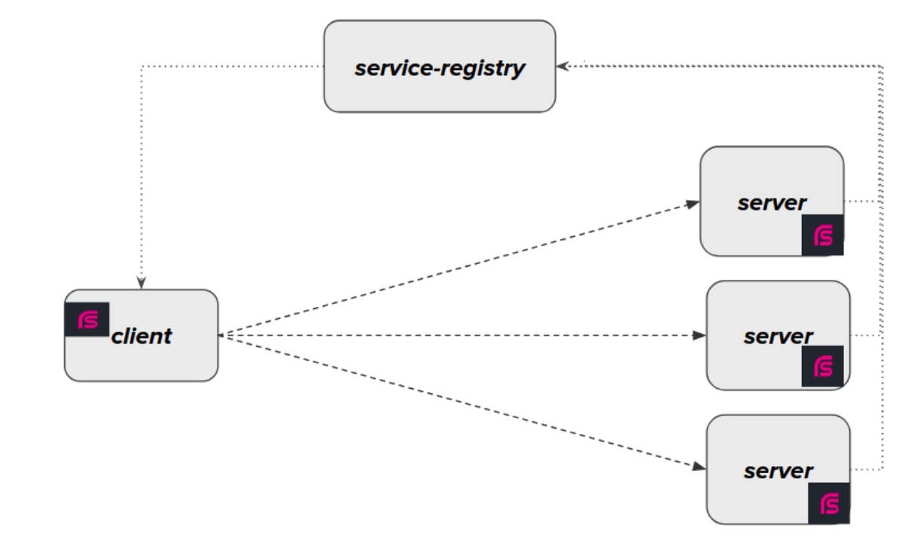

RSocket Load Balancing with Spring Cloud Registry
=================================================

基于Spring Cloud服务注册发现架构实现RSocket负载均衡，架构如下：



# 如何运行?

* 首先启动Consul： `docker-compose up -d consul` ，然后访问 http://localhost:8500
* 编译整个项目: `mvn -DskipTests clean package`
* 启动server-app: `java -jar server-app/target/server-app-1.0.0-SNAPSHOT.jar`
* 启动client-app: `java -jar client-app/target/client-app-1.0.0-SNAPSHOT.jar`
* 测试服务： `curl http://localhost:9080/square/3`


# 应用和服务命名规范
Spring Cloud的注册发现机制是基于`spring.application.name`，也就是后续的服务查找就是基于该名称进行的。  
如果你调用`ReactiveDiscoveryClient.getInstances(String serviceId);`查找服务实例列表时，这个serviceId参数其实就是Spring的应用名称。
考虑到服务注册和后续的RSocket服务路由，所以我们打算设计一个简单的命名规范。

**注意：** 应用名称不能包含"."，这个不是合法的DNS主机名，会被Service Registry转换为"-"。

假设你有一个服务应用，功能名称为calculator，同时提供两个服务: 数学计算器服务(MathCalculatorService)和汇率计算服务(ExchangeCalculatorService),
那么我们该如何如何来命名应用？ 这里我们采用Java package命名规范，如 `com-example-calculator`，这样可以确保不会和其他应用重名，另外也方便和Java Package名称进行转换。

那么服务接口应该如何命名？ 服务接口基于应用名称和interface名称构建，规则为 `String serviceName = appName.replace("-", ".") + "." + interfaceName; ` ，
如下述命名都是合乎规范的：

* com.example.calculator.MathCalculatorService
* com.example.calculator.ExchangeCalculatorService

而 `com.example.calculator.math.MathCalculatorService` 则是错误的 :x:, 因为在应用名称和接口名称之间多了`math`。

在RSocket的架构中还有另外一种架构方式，就是Broker架构，如果一个RSocket服务提供者同时端口监听和Broker注册，那么如何通过broker来访问该服务？
这里我们采用一个`broker:`前缀来判断，如缺省的broker集群的应用名称为`broker`, 当然也可以为`broker1`, `broker2`，通过这种添加前缀的方式，我们可以识别出是否要经过Broker进行通讯，
样例的名称如 `broker:com.example.calculator.MathCalculatorService`。当然你可以可以通过这种方式指定特定的应用名称，如`server-1:com.example.calculator.MathCalculatorService`。

为何要采用这种命名规范？ 首先让我们看一下是如何调用远程RSocket服务的：

* 首先我们根据Service全面提取处对应的应用名称(appName)，如 `com.example.calculator.MathCalculatorService` 服务对应的appName则为`com-example-calculator`
* 调用`ReactiveDiscoveryClient.getInstances(appName)` 获取应用名对应的实例列表
* 根据`RSocketRequester.Builder.transports(servers)` 构建具有负载均衡能力的RSocketRequester
* 使用服务全称作为路由进行RSocketRequester的API调用，样例代码如下：

```
 rsocketRequester.route("com.example.calculator.MathCalculatorService.square")
                .data(number)
                .retrieveMono(Integer.class)
```

通过该种命名方式，我们可以从服务全称中提取中应用名，然后和服务注册中心交互查找对应的实例列表，然后建立和服务提供者的连接，最后基于服务名称进行服务调用。

回到最前面说到的规范，如果应用名和服务接口的绑定关系你实在做不到，那么你可以使用这种方式实现服务调用，  
如`calculator-server:com.example.calculator.math.MathCalculatorService`，  
只是你需要更完整的文档说明，当然这种方式也可以解决之前系统接入到目前的架构上，应用的迁移成本也比较小。


# References

* YMNNALFT: Easy RPC with RSocket: https://spring.io/blog/2021/01/18/ymnnalft-easy-rpc-with-rsocket
* Spring Cloud Consul: https://docs.spring.io/spring-cloud-consul/docs/current/reference/html/
* RSocket Load Balancing: https://www.vinsguru.com/rsocket-load-balancing-client-side/
